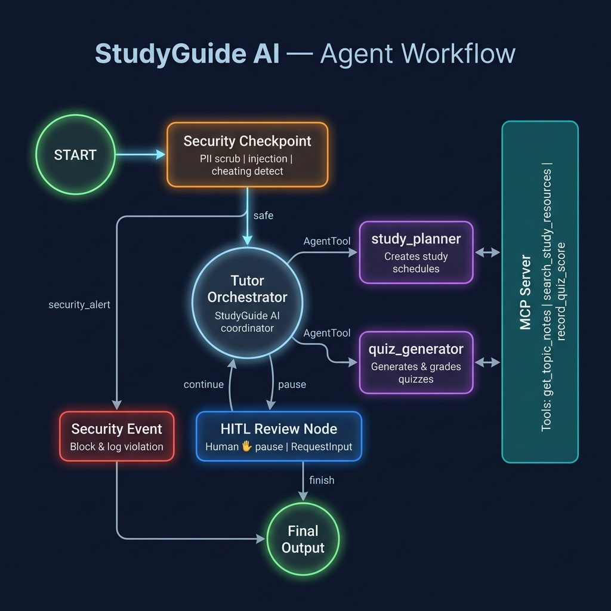
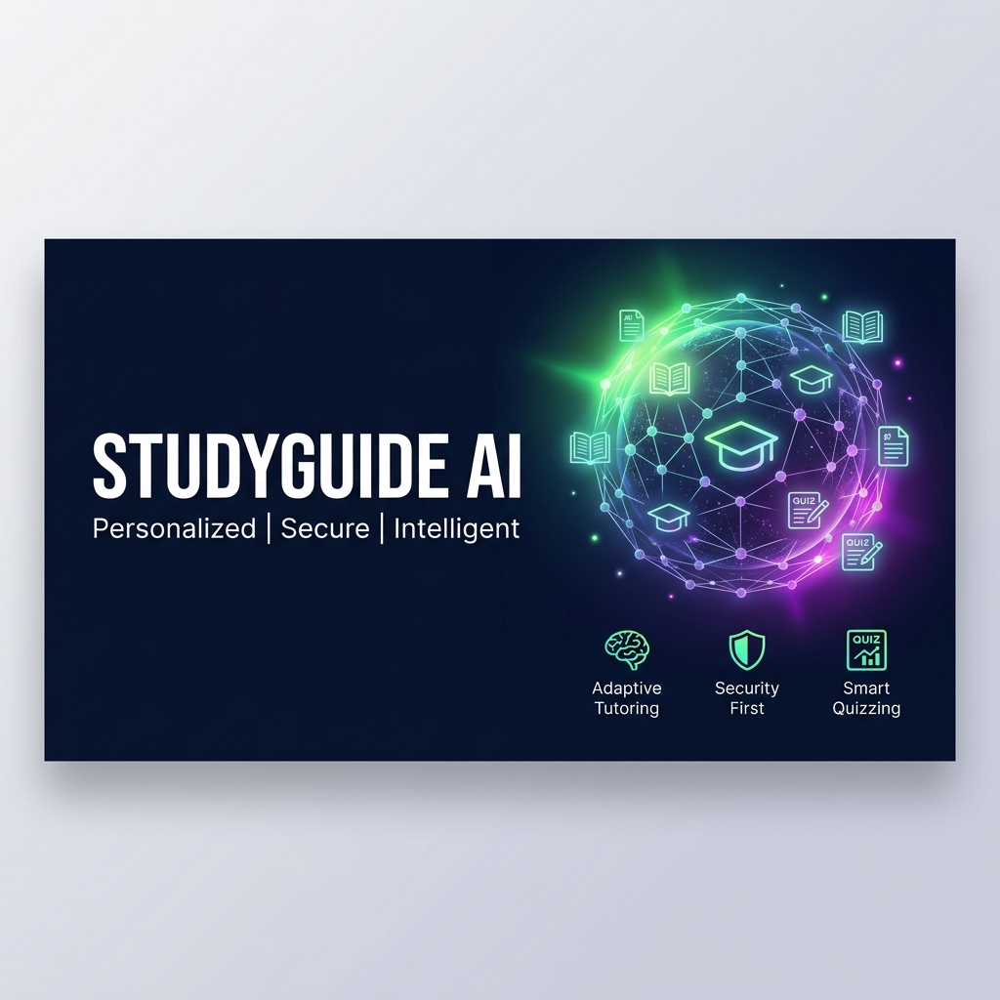
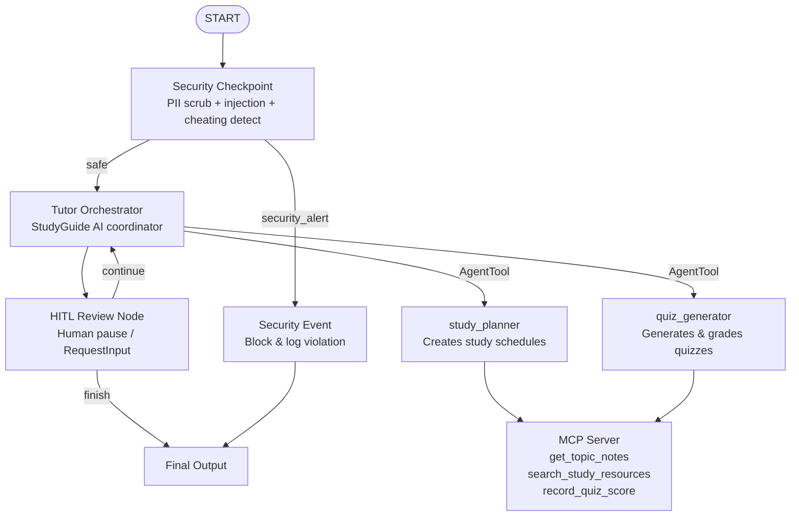

# StudyGuide AI

> A personalized tutor and exam preparation agent powered by Google ADK, MCP, and Gemini.

StudyGuide AI is an intelligent multi-agent system that helps students create custom study plans, generate quizzes, track scores, and prepare for exams — all in a secure, human-in-the-loop workflow.

---

## Assets





---

## Prerequisites

- Python 3.11+
- [uv](https://docs.astral.sh/uv/getting-started/installation/) (package manager)
- Gemini API key from [aistudio.google.com/apikey](https://aistudio.google.com/apikey)

---

## Quick Start

```bash
git clone <repo-url>
cd studyguide-ai
cp .env.example .env   # add your GOOGLE_API_KEY
make install
make playground        # opens UI at http://localhost:18081
```

---

## Architecture



---

## How to Run

```bash
make playground   # → interactive UI test at http://localhost:18081
make run          # → local web server mode
```

---

## Sample Test Cases

### 1. Study Plan Request

```
Input:    I want to prepare for my high school biology exam on Photosynthesis in two weeks. Help me plan.
Expected: study_planner is invoked via AgentTool, calls get_topic_notes('photosynthesis') from MCP,
          returns a structured 2-week study plan with milestones and daily focus areas.
Check:    The playground shows a detailed study plan response from the tutor_orchestrator.
```

### 2. Quiz Generation

```
Input:    I'm ready for a quiz on Photosynthesis.
Expected: quiz_generator is invoked via AgentTool, generates 3–5 multiple-choice questions,
          awaits answers, grades them, and calls record_quiz_score via MCP.
Check:    See quiz questions in playground UI; after answering, see score summary in response.
```

### 3. PII Redaction (Security)

```
Input:    My email is student@example.com and I want to study python decorators.
Expected: security_checkpoint scrubs email to [REDACTED_EMAIL], logs WARNING to security_audit.jsonl,
          then proceeds normally to study_planner for python decorators via MCP.
Check:    Response shows python decorator notes; security_audit.jsonl has a WARNING entry.
```

---

## Troubleshooting

| Issue | Fix |
|---|---|
| `404 model not found` | Ensure `.env` has `GEMINI_MODEL=gemini-2.5-flash` (not gemini-1.5-*) |
| `No agents found` / `extra arguments` on `adk web` | Use `uv run adk web app ...` — the agent dir is `app`, not `application` |
| Agent looks stale after code edit | On Windows, hot-reload is disabled. Kill the server and restart: `Get-Process -Id (Get-NetTCPConnection -LocalPort 18081 -ErrorAction SilentlyContinue).OwningProcess \| Stop-Process -Force` |

---

## Push to GitHub

1. Create a new repo at https://github.com/new
   - Name: `studyguide-ai`
   - Visibility: Public or Private
   - Do NOT initialize with README (you already have one)

2. In your terminal, navigate into your project folder:
   ```bash
   cd studyguide-ai
   git init
   git add .
   git commit -m "Initial commit: studyguide-ai ADK agent"
   git branch -M main
   git remote add origin https://github.com/<your-username>/studyguide-ai.git
   git push -u origin main
   ```

3. Verify `.gitignore` includes:
   - `.env`  ← your API key — must **NEVER** be pushed
   - `.venv/`
   - `__pycache__/`
   - `*.pyc`
   - `.adk/`

> ⚠️ **NEVER push `.env` to GitHub. Your API key will be exposed publicly.**

---

## Demo Script

See [DEMO_SCRIPT.txt](DEMO_SCRIPT.txt) for the full presentation narration.
